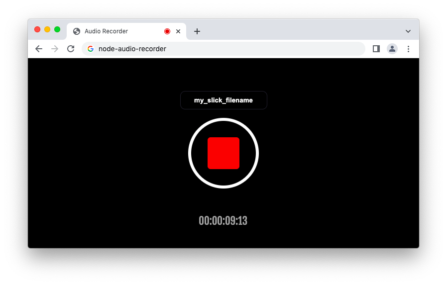
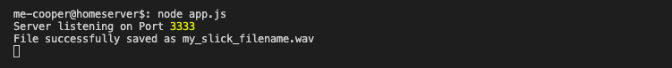
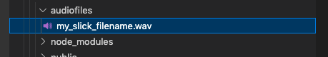

# Realtime audio recording with Node.JS

This program runs a Node.JS Webserver which provides a simple audio recorder.



## Install

`git clone https://github.com/me-cooper/node-audio-recorder.git`

`npm install`

`node app.js`

You will see following message on your console:

`Server listening on Port 3333`

## Usage

Now you can navigate to http://localhost:3333 and start recording audiofile via webbrowser.

Files are stored in `./audiofiles`. Filename is set up via textbox in webbrowser. Files are recorded in `.wav`.

## Settings

You can quick switch setting inside of `./settings/settings.js`

```javascript
module.exports = {
    server: {
        port: 3333
    },
    audio: {
        destinationFolder: "audiofiles"
    }
}
```


---





---

### Development Notes

If you want to use the client on mobile devices, a HTTPs connection to the server may be required. Otherwise some devices won't even give access to your microphone.

If you use a reverse proxy in front of your application, lease also consider the websocket connection. Here is my example for a **Apache2 webserver**.

```apache
# Required for websockets
RewriteEngine on
RewriteCond %{HTTP:UPGRADE} ^WebSocket$ [NC]
RewriteCond %{HTTP:CONNECTION} ^Upgrade$ [NC]
RewriteRule .* ws://localhost:3333%{REQUEST_URI} [P]
```

